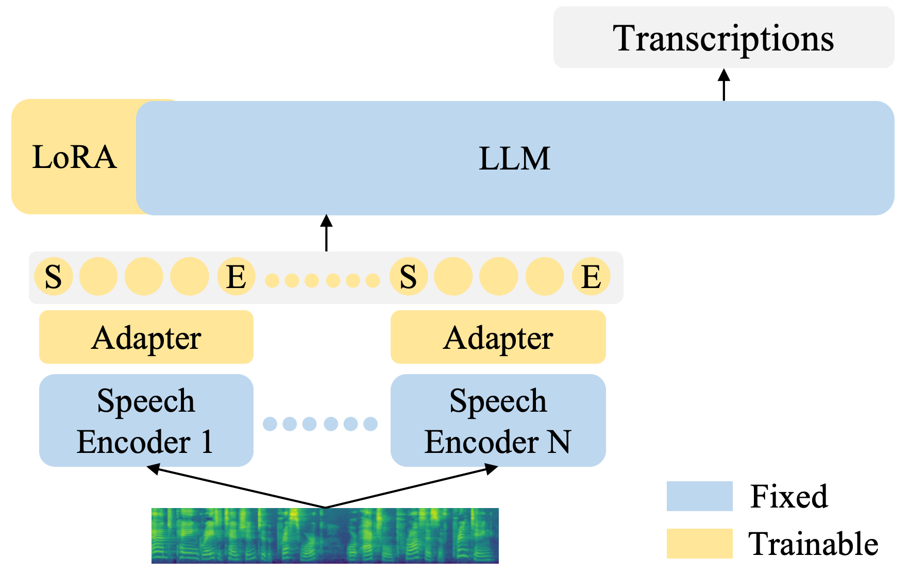

# Introduction


This project presents a training and inference pipeline for LLM-based Automatic Speech Recognition (ASR) models. These models have achieved state-of-the-art performance on the LibriSpeech dataset under the setting where no additional speech data is utilized.

By "LLM-based ASR models", we refer to a model architecture in which speech feature extracted by a speech encoder are fed into a LLM, which then generates the corresponding text transcriptions. Specifically, this project employs Zipformer as the speech encoder and Qwen2 as the LLM.

<p align="center">

</p>

# Results


|Model|         Training Dataset  | Speech Encoder | LLM |  Projector |LibriSpeech test-clean | LibriSpeech test-other | 
|-| -------------------------| ----------------|------|---------------| -----------| -----------|
|[Zipformer + LLM](https://huggingface.co/zhu-han/asr_librispeech_zipformer_qwen2_1.5B)  | LibriSpeech  | Zipformer Large Transducer/CR-CTC, freeze| Qwen2-1.5B-Instruct, LoRA | Linear, 4x downsample| 1.86 | 3.86 |
|[Zipformer MoSE + LLM](https://huggingface.co/zhu-han/asr_librispeech_zipformer_mose_qwen2_1.5B)  | LibriSpeech  | Mixture-of-Speech-Encoders (4 Zipformer Large models), freeze| Qwen2-1.5B-Instruct, LoRA | Linear, 4x downsample| 1.75 | 3.50 |


# How to use

### 1. Install dependencies

```bash
pip install -r requirements.txt
pip install huggingface_hub['cli']
```

Install k2: refer to https://k2-fsa.org/get-started/k2/ for details.

### 2. Prepare data

```bash
local/prepare.sh
```
This script following the `prepare.sh` in the icefall LibriSpeech recipe to prepare the data.
Your can skip this step if you have already prepared the data.

### 3. Prepare pre-trained speech encoder and LLM model

Download the Qwen2-1.5B-Instruct LLM model.
```bash
mkdir -p models/qwen2-1.5b-instruct
huggingface-cli download  --local-dir models/qwen2-1.5b-instruct     Qwen/Qwen2-1.5B-Instruct
```

For baseline model, download one pre-trained Zipformer model:

```bash
mkdir -p models/zipformer/librispeech/transducer_crctc_large

wget -P models/zipformer/librispeech/transducer_crctc_large \
    https://hf-mirror.com/Zengwei/icefall-asr-librispeech-zipformer-large-transducer-with-CR-CTC-20241019/resolve/main/exp/pretrained.pt

wget -P models/zipformer/librispeech \
    https://hf-mirror.com/Zengwei/icefall-asr-librispeech-zipformer-large-transducer-with-CR-CTC-20241019/resolve/main/data/lang_bpe_500/bpe.model 
```

For MoSE (Mixture-of-Speech-Encoders) model, download 4 pre-trained Zipformer model:

```bash
mkdir -p models/zipformer/librispeech/transducer_crctc_large \
        models/zipformer/librispeech/aed_crctc_large \
        models/zipformer/librispeech/crctc_large \
        models/zipformer/librispeech/transducer_large

wget -P models/zipformer/librispeech/transducer_crctc_large \
    https://hf-mirror.com/Zengwei/icefall-asr-librispeech-zipformer-large-transducer-with-CR-CTC-20241019/resolve/main/exp/pretrained.pt

wget -P models/zipformer/librispeech/aed_crctc_large \
    https://hf-mirror.com/Zengwei/icefall-asr-librispeech-zipformer-large-cr-ctc-aed-20241020/resolve/main/exp/pretrained.pt

wget -P models/zipformer/librispeech/crctc_large \
    https://hf-mirror.com/Zengwei/icefall-asr-librispeech-zipformer-large-cr-ctc-20241018/resolve/main/exp/pretrained.pt

wget -P models/zipformer/librispeech/transducer_large \
    https://hf-mirror.com/Zengwei/icefall-asr-librispeech-zipformer-large-2023-05-16/resolve/main/exp/pretrained.pt

wget -P models/zipformer/librispeech \
    https://hf-mirror.com/Zengwei/icefall-asr-librispeech-zipformer-large-transducer-with-CR-CTC-20241019/resolve/main/data/lang_bpe_500/bpe.model

```

### 4. Training

Baseline model:

```bash
python3 src/train.py \
  --world-size 4 \
  --max-duration 200 \
  --num-epochs 10 \
  --exp-dir exp/asr_librispeech_zipformer_qwen2_1.5B \
  --manifest-dir data/fbank
```

MoSE model:

```bash
python3 src/train_mose.py \
  --world-size 4 \
  --max-duration 200 \
  --num-epochs 10 \
  --exp-dir exp/asr_librispeech_zipformer_mose_qwen2_1.5B \
  --manifest-dir data/fbank
```

### 5. Decoding

Baseline model:

```bash
python3 src/decode.py \
  --exp-dir ./exp/exp/asr_librispeech_zipformer_qwen2_1.5B \
  --epoch 10 \
  --avg 5 \
  --max-duration 200 \
  --manifest-dir data/fbank
``` 

MoSE model:

```bash
python3 ./src/decode_mose.py \
  --max-duration 2000 \
  --exp-dir exp/asr_librispeech_zipformer_mose_qwen2_1.5B \
  --epoch 10 --avg 5 \
  --manifest-dir data/fbank
  ```